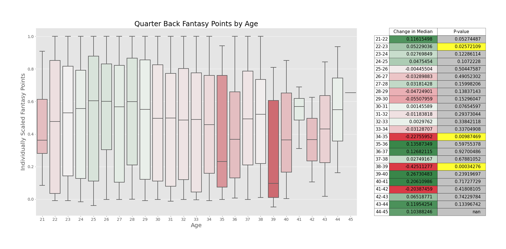
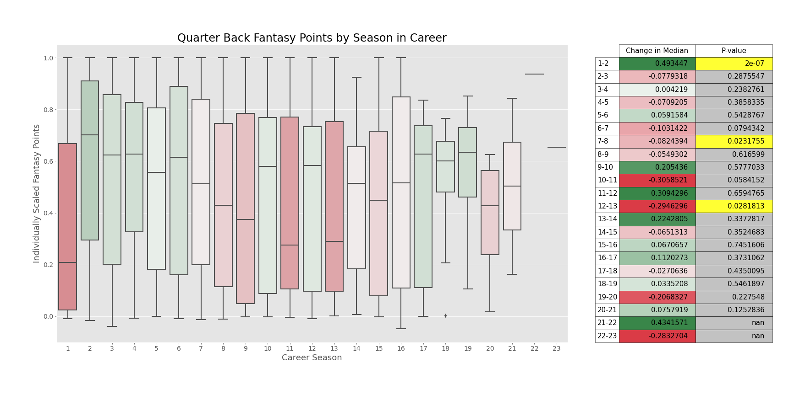
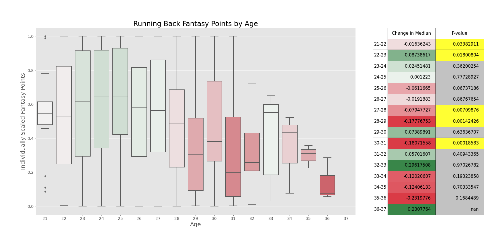
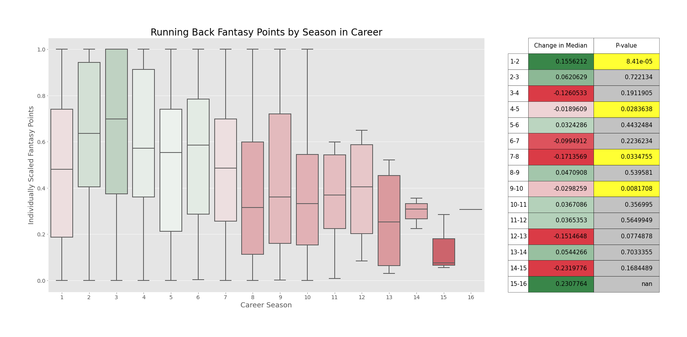
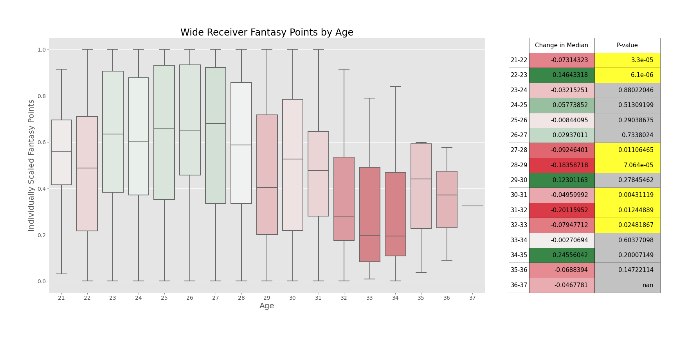
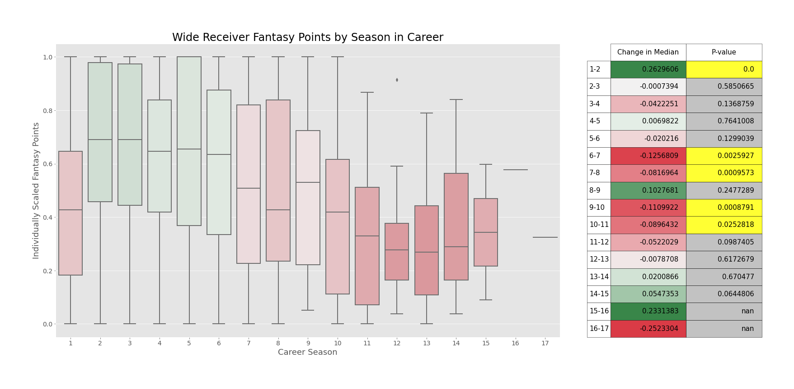
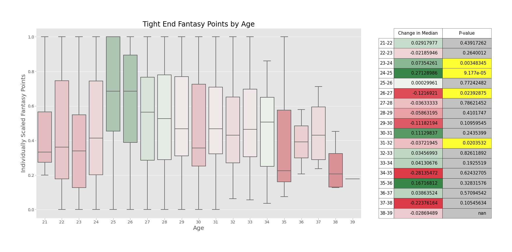
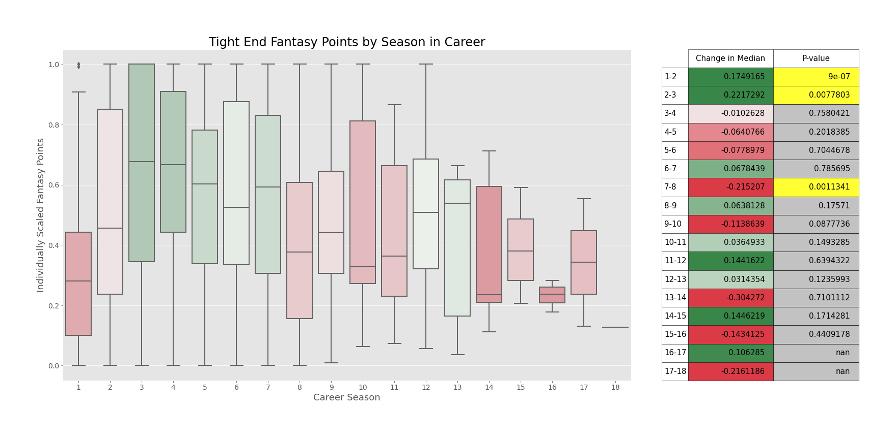

# Fantasy Point Dropoffs

## When to sell on players in dynasty fantasy football
### Tommy Evans-Barton

##### Data courtesy of pro-football-reference.com

## I. Introduction

Dynasty fantasy football, moreso than any other format, is inherently cyclical; you draft young players hoping they someday turn into stars, see them blossom through their career, and then either watch them ride off into the sunset on your bench, or attempt to trade them for young players or picks to start this cycle over again. And this last piece is the part of the strategy that the best teams are able to execute most effectively. But when is the best time to trade a player? If they have a few good seasons left in them, they could help lead you to championship glory. However, if you wait too long, you may be left holding the bag on a player who no longer has any value whatsoever. This is the question that this analysis hopes to answer.

## II. Data

All data used in this project is from pro-football-reference.com, scraped using a custom module that I wrote. I started with players who recorded a stat in either 2017 or 2022, as I wanted to have a group of players whose playing careers were recent enough so as to be relevant to the modern game, and pulled the fantasy points they scored at each age of their career. For the purposes of this analysis, fantasy points were calculated using PPR rules with 6 points per passing touchdown, as these are the rules in my current dynasty league.

Then, the data was cleaned so as to limit it to players who had played at least 4 seasons, and who had at least one season above the 50th percentile for fantasy points in the sample (giving us cutoffs of at least one season greater than 95.19 fantasy points for quarterbacks, 73.25 fantasy points for running backs, 74.3 fantasy points for wide receivers, and 42.25 fantasy points for tight ends). This left us with sample sizes of 126 quarterbacks, 129 running backs, 173 wide receivers, and 100 tight ends. Finally, the data was scaled for each individual player, dividing each player's fantasy points at each age of their career by their career high in fantasy points, so as to see when a player is peaking relative to their own talent level. From this, we got the fantasy points by years of experience, basing on the youngest age that a player had in the NFL as their first career season.

## III. Process

In order to analyze the change in a player's fantasy production year to year, I used a paired two-sample t-test between consecutive ages (comparing age 21 to 22, 22 to 23, etc.) as well as consecutive career seasons. In order to do this, for each comparison I could only use players who had data for both of the ages (or career seasons) that I was comparing against one another. Using a sensitivity (p-value) of .05, I was then able to see whether or not these two years I was comparing were statistically similar (null hypothesis) or statistically different (alternative hypothesis).

## IV. Results

### Quarterbacks

 

For quarterbacks, it seems that they develop the most from their first year to their second year in the league, and that they **fall off the most from their age 34 to 35 season**. From these visualizations however, it does seem that while quarterbacks do hit their peaks in their mid twenties, they hold their fantasy output as they age more than any other position. In addition, while there is also a notable drop off from age 38 to 39, the low number of players that actually play to that age make this drop off not as significant as the one from age 34 to 35.

### Running Backs

 

For runningbacks, it seems that they also develop the most from their first year to their second year in the league, and that they **fall off the most from their age 27 to 28 AND 28 to 29 seasons**. Also, from these visualizations, while they don't necessarily fall off to a statistically significant level until age 28, when their fantasy production drops precipitously, it is still noteworthy that they fall off in their 5th season, and really do seem to peak most notably in their third season in the league, perhaps indicating that fantasy managers should be moving off of runningbacks in dynasty even earlier than previously thought.

### Wide Receivers

 

For wide receivers, it seems that they also develop the most from their first year to their second year in the league, and that they **fall off the most from their 6th to 7th AND 7th to 8th year in the league. Additionally, you can see drops from ages 27 to 28 and 28 to 29**, as well as drops each year from age 30 on. From these visualizations, it seems that the best bets to make are on second year wide receivers, and also that perhaps wide receivers age cliffs might be more similar to runningbacks than general consensus.

### Tight Ends

For tight ends, it seems that they also develop the most from their first year to their second year in the league, but also noticeably from their secodn to third year in the league, and that they **fall off the most from their 7th to 8th year in the league**. However, it is interesting that in their age graphs, you can see that their fantasy production holds steady far more than their other skill position counterparts, the runningbacks and wide receivers.

## V. Conclusion

Ultimately, it seems that the biggest takeaway is that for dynasty you should aim to go as young as possible on runningbacks, focusing on players in their first 3 years in the league, while attempting to move off of receivers earlier than you initially may have thought. Meanwhile, quarterbacks and tight ends, while peaking at similar times as the other positions, can be kept longer and still have value.

